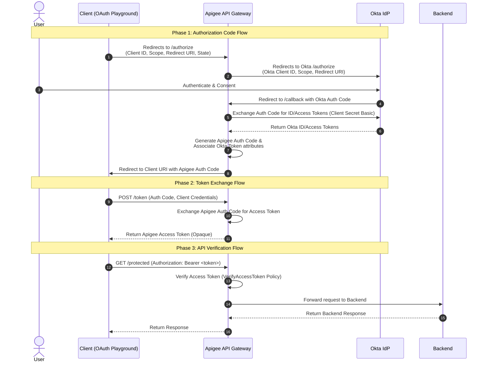

# Apigee OIDC Integration with Okta

This repository contains the configuration and resources to integrate **Apigee** with **Okta** as an external Identity Provider (IdP) using the OpenID Connect (OIDC) protocol. 

In this architecture, Apigee acts as an OAuth 2.0 Authorization Server and API Gateway. It mediates the authentication flow (Authorization Code Grant) with Okta, stores the issued tokens, and validates incoming API requests locally without forwarding every request to Okta.

---

## Architecture

The following diagram illustrates the interaction between the Client, Apigee, and Okta during the OAuth 2.0 Authorization Code Flow and subsequent API calls.

### Sequence Flow



### Key Highlights
1. **Opaque Tokens**: The client application only receives an opaque access token minted by Apigee. The backend Okta tokens (Access/ID Token) are stored securely as custom attributes within Apigee.
2. **Local Token Verification**: Subsequent API calls are validated inside Apigee via the `VerifyAccessToken` policy, ensuring minimal latency and high performance.
3. **Decoupled Client Management**: The API client registers and authenticates against Apigee, while user identity remains centralized in Okta.

---

## Okta Setup

Follow these steps to configure your Okta Developer Account to work with Apigee.

### 1. Register a Web Application in Okta
1. Sign in to your [Okta Developer Console](https://developer.okta.com/).
2. In the left-hand navigation menu, go to **Applications** > **Applications**.
3. Click **Create App Integration**.
4. Select **OIDC - OpenID Connect** as the Sign-in method, and **Web Application** as the Application type. Click **Next**.
5. Configure the application:
   - **App integration name**: `Apigee-OIDC-Facade`
   - **Grant type**: Authorization Code
   - **Sign-in redirect URIs**: 
     ```text
     https://{your-apigee-hostname}/v1/oauth20/callback
     ```
     *(Example: `https://34.149.2.239.nip.io/v1/oauth20/callback`)*
   - **Controlled access**: Select **Allow everyone in your organization to access** (or configure groups accordingly).
6. Click **Save**.

### 2. Capture Client Credentials & Okta Domain
On the Okta App configuration page, copy and save the following credentials:
- **Client ID**
- **Client Secret**
- **Okta Domain** (e.g., `dev-XXXXXX.okta.com`)

### 3. Create a Test User in Okta
1. Navigate to **Directory** > **People**.
2. Click **Add Person**.
3. Fill out the user details (a real email address is not required if the password is set by the admin).
4. Set the password option to **Set by Admin** and configure a password.
5. Click **Save**.

---

## oidc proxy Setup

To set up the OIDC API proxy in Apigee, configure a proxy bundle with the following endpoints and policies.

### Endpoints Configuration

* **`GET /authorize`**:
  - Redirects the user's browser to Okta's authorize endpoint.
  - URL format: `https://{okta-domain}/oauth2/v1/authorize?client_id={okta-client-id}&response_type=code&scope=openid%20profile%20email&redirect_uri=https://{apigee-hostname}/v1/oauth20/callback&state={state}`

* **`GET /callback`**:
  - Receives the authorization code from Okta.
  - Performs a **Service Callout** (or custom script) to Okta's token endpoint (`https://{okta-domain}/oauth2/v1/token`) using Apigee's Okta client credentials to exchange the authorization code for Okta ID and Access tokens.
  - Stores the retrieved Okta tokens.
  - Calls Apigee's **OAuthV2 policy** with the `GenerateAuthorizationCode` operation to generate an Apigee-specific authorization code, embedding the Okta tokens/claims as custom attributes.
  - Redirects the client back to their original `redirect_uri` with the generated authorization code.

* **`POST /token`**:
  - Standard OAuth 2.0 token endpoint.
  - Uses Apigee's **OAuthV2 policy** with the `GenerateAccessToken` operation to exchange the Apigee authorization code for an Apigee Access Token.

* **`GET /protected`** (or any proxy endpoint):
  - Uses the **OAuthV2 policy** with the `VerifyAccessToken` operation to validate incoming requests.

---

## Test

To verify the integration, use the **Google Developers OAuth 2.0 Playground**.

### 1. Configure the Playground Settings
1. Open the [Google Developers OAuth 2.0 Playground](https://developers.google.com/oauthplayground).
2. Click the gear icon (OAuth 2.0 Configuration) in the top-right corner.
3. Check **Use your own OAuth credentials**.
4. Configure the following fields:
   - **OAuth flow**: Server-side (Authorization Code)
   - **Authorization endpoint**: `https://{your-apigee-hostname}/v1/oauth20/authorize`
   - **Token endpoint**: `https://{your-apigee-hostname}/v1/oauth20/token`
   - **OAuth Client ID**: *{Your Apigee App's Consumer Key}*
   - **OAuth Client Secret**: *{Your Apigee App's Consumer Secret}*
5. Close the configuration panel.

### 2. Run the Flow

#### Step 1: Request Authorization Code
1. In the **Input scopes** text box, enter `openid profile email`.
2. Click **Authorize APIs**.
3. You will be redirected to the Okta login screen via Apigee.
4. Log in using the test user credentials created in Okta.
5. After successful login, you will be redirected back to the OAuth Playground with an **Authorization code**.

#### Step 2: Exchange Code for Access Token
1. Click **Exchange authorization code for tokens**.
2. Playground will call Apigee's `/token` endpoint and return an opaque Apigee access token.

#### Step 3: Access Protected API
1. In Step 3 of the Playground, set the **Request URI** to:
   ```text
   https://{your-apigee-hostname}/v1/oauth20/protected
   ```
2. Click **Send request**.
3. Confirm that the request returns `200 OK` along with the expected payload, validating that Apigee successfully verified the token locally.
