# Apigee OIDC Integration with Okta

This repository contains the configuration and resources to integrate **Apigee** with **Okta** as an external Identity Provider (IdP) using the OpenID Connect (OIDC) protocol. 

In this architecture, Apigee acts as an OAuth 2.0 Authorization Server and API Gateway. It mediates the authentication flow (Authorization Code Grant) with Okta, stores the issued tokens, and validates incoming API requests locally without forwarding every request to Okta.

---

## Architecture

The following diagram illustrates the interaction between the Client, Apigee, and Okta during the OAuth 2.0 Authorization Code Flow and subsequent API calls.
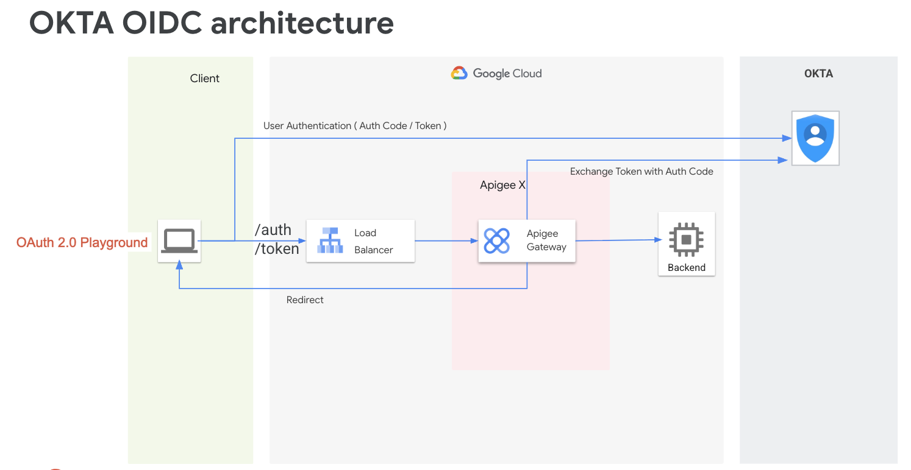


### Sequence Flow

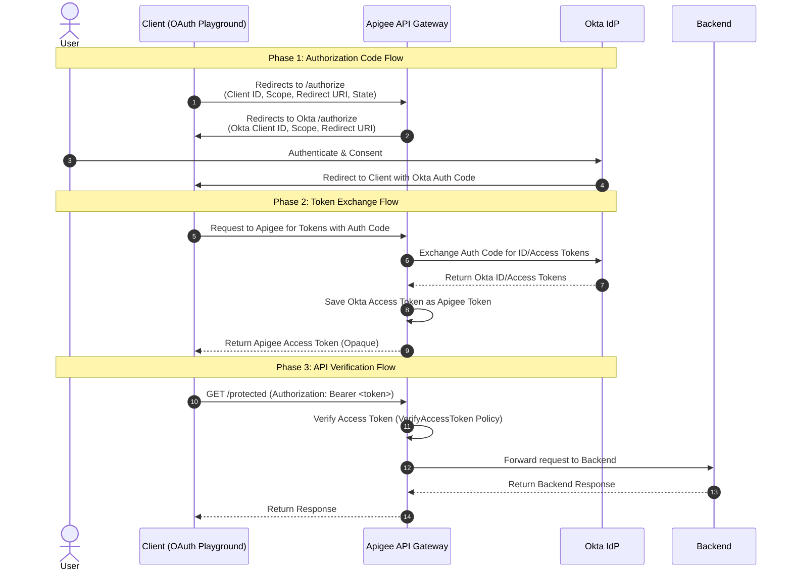

### Key Highlights
1. **Opaque Tokens**: The client application only receives an opaque access token minted by Apigee. The backend Okta tokens (Access/ID Token) are stored securely as custom attributes within Apigee.
2. **Local Token Verification**: Subsequent API calls are validated inside Apigee via the `VerifyAccessToken` policy, ensuring minimal latency and high performance.
3. **Decoupled Client Management**: The API client registers and authenticates against Apigee, while user identity remains centralized in Okta.

---

## Okta Setup

Follow these steps to configure your Okta Developer Account to work with Apigee.

### 1. Register a Web Application in Okta
1. Sign in to your [Okta Developer Console](https://developer.okta.com/).
2. In the left-hand navigation menu, go to **Applications** > **Applications**.
3. Click **Create App Integration**.
4. Select **OIDC - OpenID Connect** as the Sign-in method, and **Web Application** as the Application type. Click **Next**.
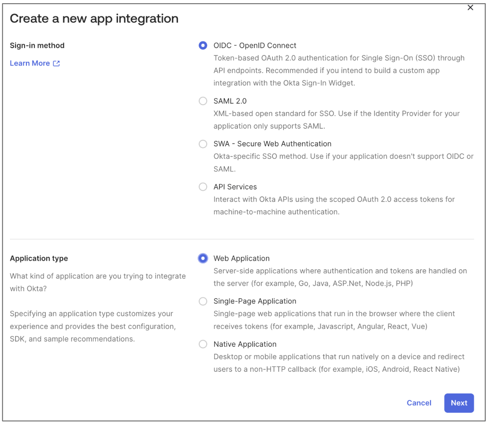
5. Configure the application:
   - **App integration name**: `Apigee App`
   - **Grant type**: Authorization Code
   - **Sign-in redirect URIs**: 
     ```text
     https://developers.google.com/oauthplayground
     ```
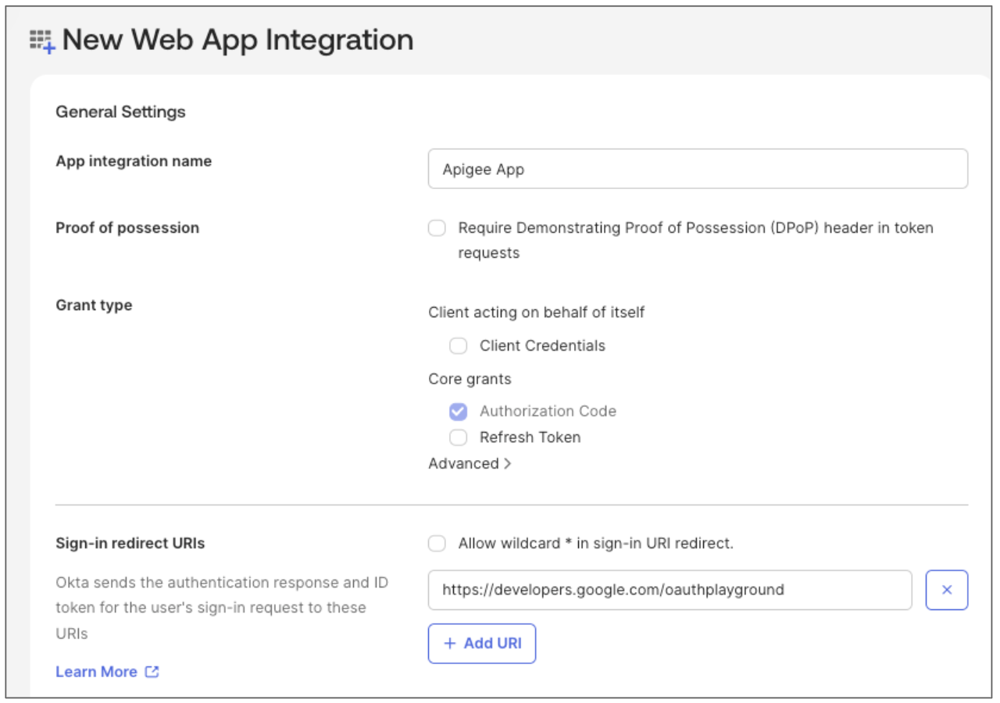   
   - **Controlled access**: Select **Allow everyone in your organization to access** (or configure groups accordingly).
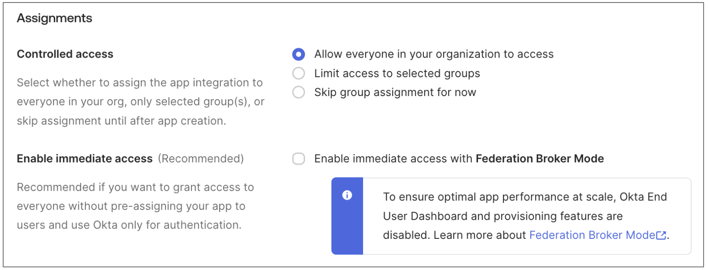
6. Click **Save**.

> [!IMPORTANT]
> **Configure Okta Access Policy (Sign-on Policy)**
> If the users testing the integration encounter the error:
> `idx error code: no matching policy - You are not allowed to access this app. To request access, contact an admin.`
> It means they do not match any rules in the application's Access Policy. 
> To resolve or prevent this, configure the Access Policy under the **Sign On** tab of the application in the Okta Admin Console:
> 1. Go to **Applications** > **Applications** and select your application.
> 2. Click the **Sign On** tab.
> 3. Under **User Access**, verify the assigned **Access Policy** and its rules.
> 4. Ensure there is a rule that matches your test user or group and permits access. For detailed steps, see the [Okta Support Article](https://support.okta.com/help/s/article/error-idx-error-code-no-matching-policy-you-are-not-allowed-to-access-this-app-to-request-access-contact-an-admin?language=en_US).


### 2. Capture Client Credentials & Okta Domain
On the Okta App configuration page, copy and save the following credentials:
- **Client ID**
- **Client Secret**
- **Okta Domain** (e.g., `integrator-XXXXXX.okta.com`)
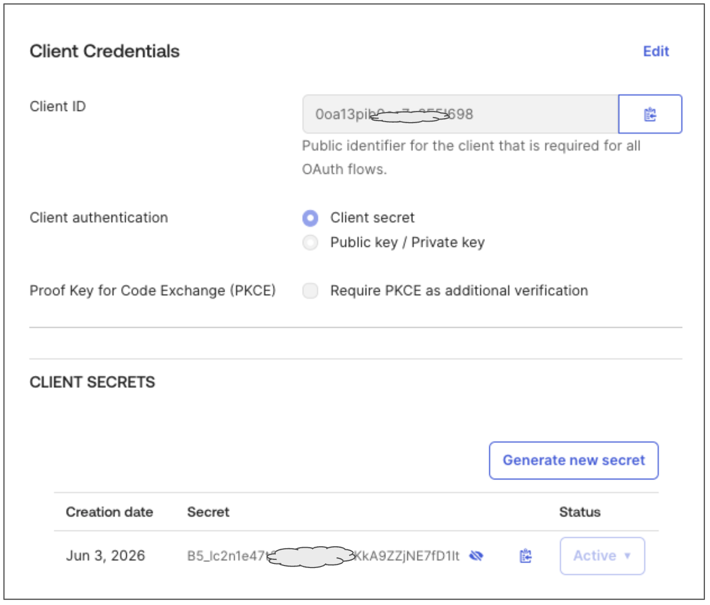

### 3. Create a Test User in Okta
1. Navigate to **Directory** > **People**.
2. Click **Add Person**.
3. Fill out the user details (a real email address is not required if the password is set by the admin).
4. Set the password option to **Set by Admin** and configure a password.
5. Click **Save**.

### 4. Assign the Application to the Test User
If you did not select "Allow everyone in your organization to access" during the application setup (or if your Okta organization requires manual assignment):
1. Navigate to **Applications** > **Applications**.
2. Click on the application you created (`Apigee App`).
3. Select the **Assignments** tab.
4. Click the **Assign** dropdown and choose **Assign to People**.
5. Find your test user, click **Assign**, and click **Save and Go Back**.
6. Click **Done**.

---

## oidc proxy Setup

### 1. Configure Okta Domain
Before deploying the proxy, configure your Okta domain:
1. Open the [okta.properties](./apiproxy/resources/properties/okta.properties) file.
2. Replace the `domain_name` value with your Okta Domain (e.g., `integrator-XXXXXX.okta.com`):
   ```properties
   domain_name=your-okta-domain
   ```
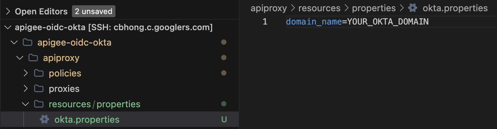

### 2. Deploy the Proxy & Configure Entities
Configure your Apigee environment variables and run the deployment script to deploy the API proxy, and automatically set up the API product and developer app.

1. Open [env.sh](./env.sh) and configure your Apigee Organization and Environment:
   ```bash
   export APIGEE_ORG="your-apigee-org"
   export APIGEE_ENV="your-apigee-env"
   ```
   Then, run the following command to apply the changes:
   ```bash
   source ./env.sh
   ```

2. Run the deployment script:
   ```bash
   ./deploy-oidc-okta.sh
   ```

3. Note down the **Client ID** (Consumer Key) and **Client Secret** (Consumer Secret) returned at the end of the script:
   ```text
   ============================================================
   Deployment and Setup Completed!
   API Proxy: oidc-okta
   Developer App: oidc-okta-app
   Client ID (Consumer Key): XXXXXXXXXXXXXXXXXXXXXXXXXXXXXXXX
   Client Secret (Consumer Secret): XXXXXXXXXXXXXXXXXXXXXXXXXXXXXXXX
   ============================================================
   ```

4. Configure the Okta Client ID and Client Secret in the Apigee Key Value Map (KVM) using the `/kvm` endpoint. The `apikey` header value must be the **Apigee Client ID** (Consumer Key) obtained in Step 3.

   **Update Okta Client ID in KVM:**
   ```bash
   curl --location 'https://{YOUR_APIGEE_HOSTNAME}/v1/oidc/kvm' \
   --header 'apikey: {YOUR_APIGEE_CLIENT_ID}' \
   --header 'Content-Type: application/json' \
   --data '{
     "kvm-key":"okta.app.id",
     "kvm-val":"YOUR_OKTA_CLIENT_ID"
   }'
   ```

   **Update Okta Client Secret in KVM:**
   ```bash
   curl --location 'https://{YOUR_APIGEE_HOSTNAME}/v1/oidc/kvm' \
   --header 'apikey: {YOUR_APIGEE_CLIENT_ID}' \
   --header 'Content-Type: application/json' \
   --data '{
     "kvm-key":"okta.app.secret",
     "kvm-val":"YOUR_OKTA_CLIENT_SECRET"
   }'
   ```

---

## Test

To verify the integration, use the **Google Developers OAuth 2.0 Playground**.

### 1. Configure the Playground Settings
1. Open the [Google Developers OAuth 2.0 Playground](https://developers.google.com/oauthplayground).
2. Click the gear icon (OAuth 2.0 Configuration) in the top-right corner.
3. Check **Use your own OAuth credentials**.
4. Configure the following fields:
   - **OAuth flow**: Server-side (Authorization Code)
   - **OAuth endpoints**: Custom
   - **Authorization endpoint**: `https://{your-apigee-hostname}/v1/oidc/oauth20/auth?state=YOUR_STATE_STRING`
   - **Token endpoint**: `https://{your-apigee-hostname}/v1/oidc/oauth20/token`
   - **OAuth Client ID**: *{Your Apigee App's Consumer Key (Client ID)}*
   - **OAuth Client Secret**: *{Your Apigee App's Consumer Secret (Client Secret)}*
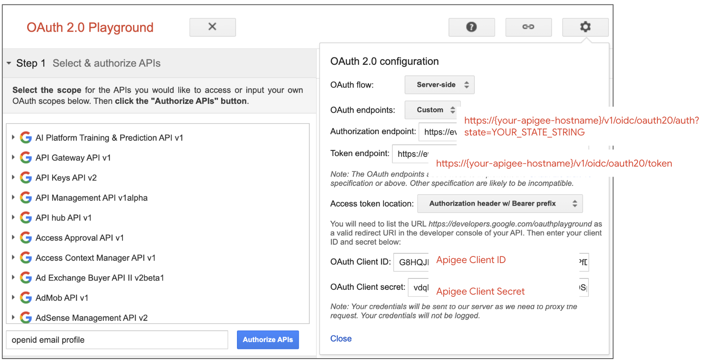

### 2. Run the Flow

#### Step 1: Request Authorization Code
1. In the **Input scopes** text box, enter `openid profile email`.
2. Click **Authorize APIs**.
3. You will be redirected to the Okta login screen via Apigee.
4. Log in using the test user credentials created in Okta.
5. After successful login, you will be redirected back to the OAuth Playground with an **Authorization code**.
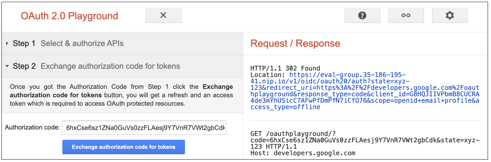

#### Step 2: Exchange Code for Access Token
1. Click **Exchange authorization code for tokens**.
2. Playground will call Apigee's `/token` endpoint and return an opaque Apigee access token.
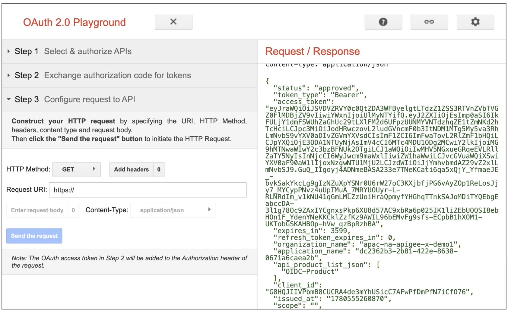

#### Step 3: Access Protected API
1. In Step 3 of the Playground, set the **Request URI** to:
   ```text
   https://{your-apigee-hostname}/v1/oidc/oauth20/protected
   ```
2. Click **Send request**.
3. Confirm that the request returns `200 OK` along with the expected payload, validating that Apigee successfully verified the token locally.
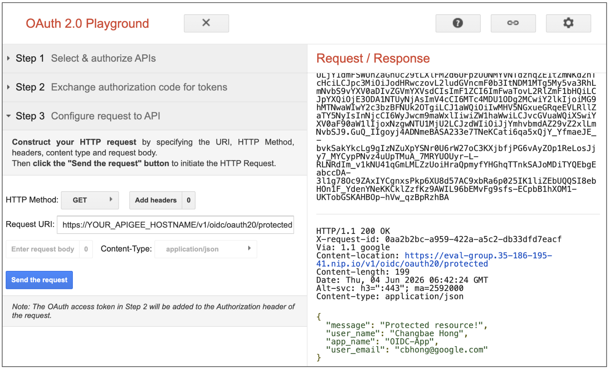

---

## Clean Up / Undeploy

Once testing is complete, you can remove all created Apigee resources (Developer App, Developer, API Product, and API Proxy) by running the cleanup script:

```bash
./undeploy-all.sh
```

